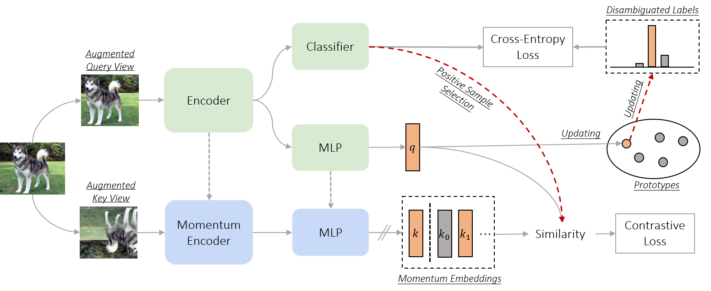
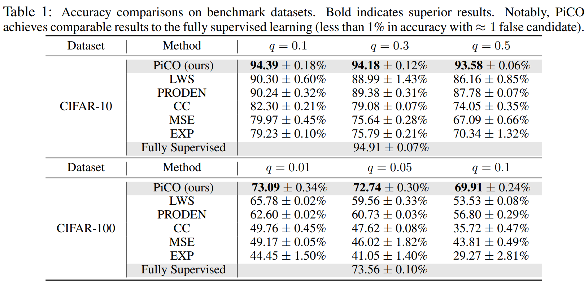

# PiCO: Contrastive Label Disambiguation for Partial Label Learning



This is a [PyTorch](http://pytorch.org) implementation of **ICLR 2022 Oral** paper [PiCO](https://openreview.net/forum?id=EhYjZy6e1gJ), also see our [Project Page](#). 

**Title:** Contrastive Label Disambiguation for Partial Label Learning

**Authors:** Haobo Wang, Ruixuan Xiao, Yixuan Li, Lei Feng, Gang Niu, Gang Chen, Junbo Zhao

**Affliations:** Zhejiang University, University of Wisconsin-Madison, Chongqing University, RIKEN

```
 @article{wang2022pico,
      title={PiCO: Contrastive Label Disambiguation for Partial Label Learning},
      author={Wang, Haobo and Xiao, Ruixuan and Li, Yixuan and Feng, Lei and Niu, Gang and Chen, Gang and Zhao, Junbo},
      journal={ICLR},
      year={2022}
 } 
```

## Start Running PiCO

PiCO is easy to be implemented and experiment with. All commands must be ran from the project root. We provide the following demo codes for model training. Also see the ```run.sh``` file.

**Data Preparation**

For CIFAR datasets, one can directly run the demo shell codes. 

For CUB200 datasets, we provide a preprocessed copy [here](#) and just put them to ```data/cub200/processed``` .

**Run cifar10 with q=0.5​**

```shell
CUDA_VISIBLE_DEVICES=0 python -u train.py \
  --exp-dir experiment/PiCO-CIFAR-10 --dataset cifar10 --num-class 10\
  --dist-url 'tcp://localhost:10001' --multiprocessing-distributed --world-size 1 --rank 0 --seed 123\
  --arch resnet18 --moco_queue 8192 --prot_start 1 --lr 0.01 --wd 1e-3 --cosine --epochs 800 --print-freq 100\
  --loss_weight 0.5 --proto_m 0.99 --partial_rate 0.5
```

**Run cifar100 with q=0.05​**

```shell
CUDA_VISIBLE_DEVICES=1 python -u train.py \
  --exp-dir experiment/PiCO-CIFAR-100 --dataset cifar100 --num-class 100\
  --dist-url 'tcp://localhost:10002' --multiprocessing-distributed --world-size 1 --rank 0 --seed 123\
  --arch resnet18 --moco_queue 8192 --prot_start 1 --lr 0.01 --wd 1e-3 --cosine --epochs 800 --print-freq 100\
  --loss_weight 0.5 --proto_m 0.99 --partial_rate 0.05
```

**Run CUB200 with q=0.1​**

```shell
CUDA_VISIBLE_DEVICES=2 python -u train.py \
 --exp-dir experiment/Prot_PLL_CUB --dataset cub200 --num-class 200\
 --dist-url 'tcp://localhost:10003' --multiprocessing-distributed --world-size 1 --rank 0 --seed 124\
 --arch resnet18 --moco_queue 4096 --prot_start 100 --lr 0.01 --wd 1e-5 --cosine --epochs 300 --print-freq 100\
 --batch-size 256 --loss_weight 0.5 --proto_m 0.99 --partial_rate 0.1
```

**A Note on Running with Multiple-GPU**

Technically, we implemented PiCO using a distributed setup because we thought parallelization would be needed. However, while we train PiCO we had never actually enabled the distributed setup but only resorted to one single GPU training. Please carefully check the code if you would like to use multiple GPUs, e.g. prepare a shared local copy of partial label targets. 

## Results

Main results on CIFAR-10 and CIFAR-100 datasets with varying q​ values. PiCO achieves SOTA results and is competitive to the supervised counterparts.

